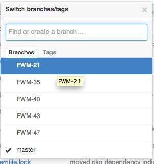
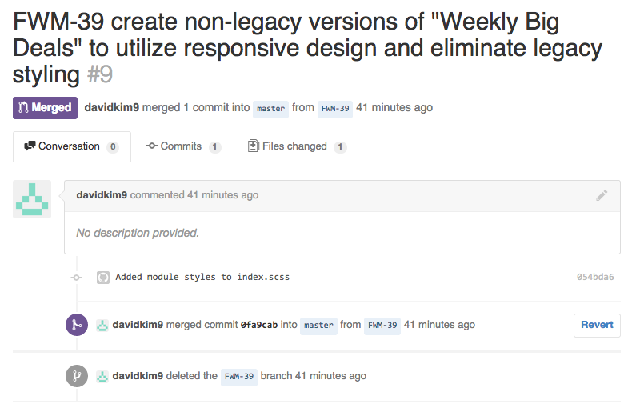

# Workflows

## Asynchronous Communication

...

## Issue Creation

...

## Development

#### Getting Started

So you're assigned a bunch of issues, or maybe you aren't, but either way you
can begin by choosing one to work on. Be sure to review the details of the
issue and make sure there's enough information for you to effectively work --
if not you need to **describe what you need in a comment** on the issue and
either reference the relevant person using the @name syntax or  **reassign the
issue to someone who can help**.

> If an issue is assigned to you it becomes your responsibility to move it
> along and get what you need. Likewise it's everyone's responsibility to
> respond and help get each other the necessary information.

Once you're ready to begin, checkout a new branch using the issue ID as the
branch name e.g. FWM-43, JAKO-49.

#### While You're Working

While you're working on the issue be sure to **rebase from `master`** often.
The short explanation is that this helps to maintain a cleaner repo history,
free of extra merge commits. If you want to read more about rebasing vs.
merging, [check this out](https://www.atlassian.com/git/tutorials/merging-vs-rebasing).

#### When You've Finished

When you're ready for the issue to be reviewed by a teammate you need to do
a few things.

1.  be sure to **rebase from `master` one last time** and push your latest
    updates to a remote branch first.
2.  create a **pull request** using the using the issue's ID and description,
    e.g. 

3.  **comment on the issue** describing the current state (whether it was
    staged and where, etc.) and **reassign the issue** to the appropriate
    teammate.

#### Reviewing An Issue

If you're on the receiving end of a completed issue / pull request, it's your
responsibility to review the commits, ensure quality, and either approve or
deny the contribution. Obviously the depth of the review can vary depending on
the scope of the issue -- you'd treat a tiny styling bug differently than a
major feature, so use your judgement. If the issue encompasses a new feature
you'll want to checkout the branch locally and run tests yourself to make sure
everything checks out, whereas a small bug can likely be approved immediately.

Once you've reviewed and accepted the issue you can take the following steps:

1. merge the PR and delete the issue branch
2. comment on the issue describing current state
3. move the issue to "Done"

You can optionally deploy the updates to production yourself or ask someone
who has that capability to take care of it, otherwise the updates will go up
with the next deployment.

